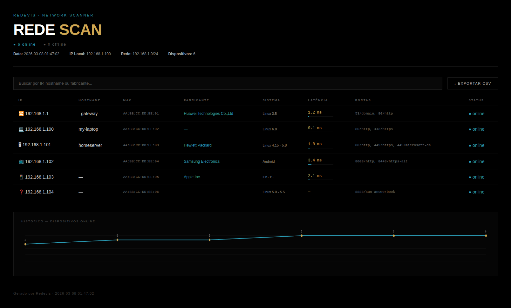

# Redevis 🔍

**PT** | [EN](#redevis--english)

Ferramenta de inventário de rede local com relatório HTML, histórico de scans e detecção de dispositivos.

---

## Funcionalidades

- Escaneia a rede local e lista todos os dispositivos ativos
- Detecta IP, hostname, fabricante (via MAC), sistema operacional e latência
- Identifica o tipo de dispositivo: roteador, computador, servidor, TV, celular
- Gera relatório HTML com visual escuro, busca, ordenação por coluna e exportação CSV
- Salva histórico dos últimos 10 scans e exibe gráfico interativo de dispositivos ao longo do tempo (com labels de horário no eixo X e tooltip ao passar o mouse)
- Compara com o scan anterior e indica dispositivos novos ou removidos
- Suporte a `--no-browser` e `--range` via linha de comando

## Demonstração



## Instalação

**Requisitos:**
- Python 3.10+
- nmap instalado no sistema
- python-nmap, scapy, manuf, zeroconf

```bash
# Instalar nmap
sudo apt install nmap -y

# Clonar o repositório
git clone https://github.com/Wilson-Cecchi/redevis.git
cd redevis

# Instalar dependências Python
sudo pip install python-nmap scapy manuf zeroconf --break-system-packages
```

> As pastas `data/` e `reports/` são criadas automaticamente na primeira execução.

## Uso

```bash
# Scan padrão (detecta a rede automaticamente)
cd redevis
sudo python3 redevis.py

# Scan em um range específico
cd redevis
sudo python3 redevis.py --range 10.0.0.0/24

# Sem abrir o navegador automaticamente
cd redevis
sudo python3 redevis.py --no-browser
```

O relatório HTML é salvo em `reports/` e aberto automaticamente no navegador.

> **Nota:** o relatório requer conexão com a internet para carregar o gráfico (Chart.js via CDN).

## Estrutura do Projeto

```
redevis/
├── redevis.py      # Ponto de entrada
├── scanner.py      # Lógica de scan (nmap + mDNS + MAC)
├── history.py      # Gerenciamento do histórico
├── report.py       # Geração do relatório HTML
├── data/
│   └── history.json
└── reports/
    └── *.html
```

## Tecnologias

- Python 3
- nmap / python-nmap
- Scapy
- Zeroconf (mDNS)
- manuf (lookup de fabricante por MAC)
- Chart.js (gráfico de histórico no relatório HTML)

## Aviso

Este projeto foi desenvolvido para uso em redes domésticas e ambientes autorizados. Não utilize em redes sem permissão explícita do administrador.

## Autor

**Wilson Klein Cecchi** — [GitHub](https://github.com/Wilson-Cecchi)

---

# Redevis — English

**[PT](#redevis-)** | EN

Local network inventory tool with HTML reports, scan history and device detection.

---

## Features

- Scans the local network and lists all active devices
- Detects IP, hostname, vendor (via MAC), operating system and latency
- Identifies device type: router, computer, server, TV, phone
- Generates a dark-themed HTML report with search, column sorting and CSV export
- Saves history of the last 10 scans and displays an interactive device count chart over time (with time labels on the X axis and hover tooltips)
- Compares with the previous scan and highlights new or removed devices
- Supports `--no-browser` and `--range` via command line

## Demo


## Installation

**Requirements:**
- Python 3.10+
- nmap installed on the system
- python-nmap, scapy, manuf, zeroconf

```bash
# Install nmap
sudo apt install nmap -y

# Clone the repository
git clone https://github.com/Wilson-Cecchi/redevis.git
cd redevis

# Install Python dependencies
sudo pip install python-nmap scapy manuf zeroconf --break-system-packages
```

> The `data/` and `reports/` folders are created automatically on first run.

## Usage

```bash
# Default scan (auto-detects network range)
cd redevis
sudo python3 redevis.py

# Scan a specific range
cd redevis
sudo python3 redevis.py --range 10.0.0.0/24

# Run without opening the browser
cd redevis
sudo python3 redevis.py --no-browser
```

The HTML report is saved to `reports/` and opened automatically in the browser.

> **Note:** the report requires an internet connection to load the chart (Chart.js via CDN).

## Project Structure

```
redevis/
├── redevis.py      # Entry point
├── scanner.py      # Scan logic (nmap + mDNS + MAC)
├── history.py      # History management
├── report.py       # HTML report generation
├── data/
│   └── history.json
└── reports/
    └── *.html
```

## Tech Stack

- Python 3
- nmap / python-nmap
- Scapy
- Zeroconf (mDNS)
- manuf (MAC vendor lookup)
- Chart.js (history chart in HTML report)

## Disclaimer

This project was developed for use on home networks and authorized environments. Do not use it on networks without explicit permission from the administrator.

## Author

**Wilson Klein Cecchi** — [GitHub](https://github.com/Wilson-Cecchi)